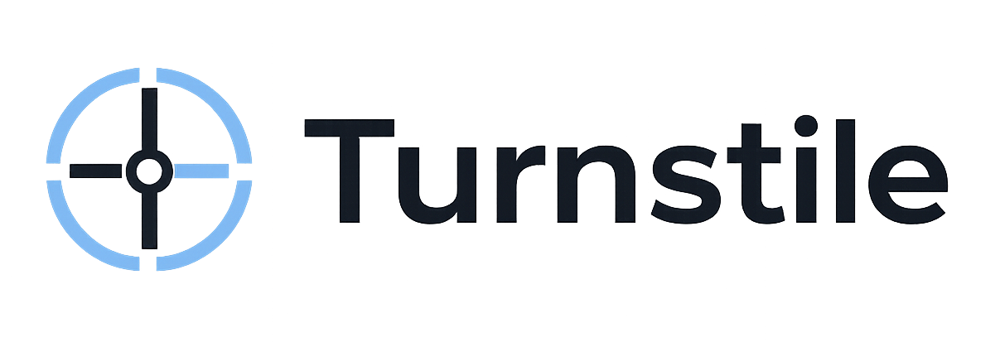
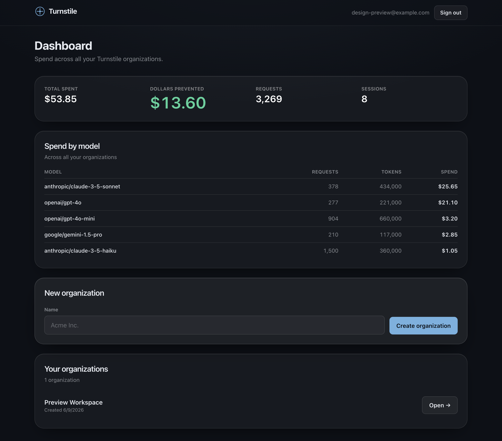
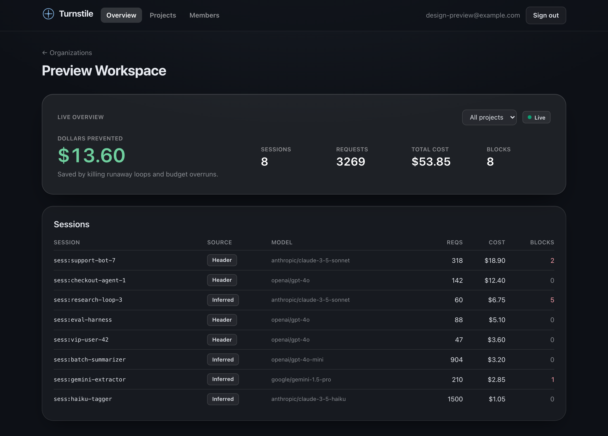
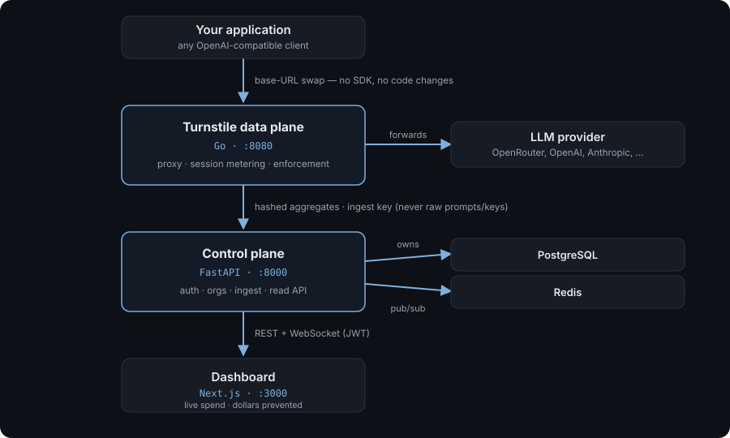

  <picture>
    <source media="(prefers-color-scheme: dark)" srcset="docs/images/turnstile-logo-light.png" />
    
  </picture>

**Turnstile kills the one rogue LLM session — a runaway agent loop or a blown budget — in real time, without taking down the rest of your app.**

**Website:** [turnstileguard.com](https://turnstileguard.com)

> **Status:** working end-to-end via OpenRouter today; direct OpenAI and Anthropic adapters in progress. See the [roadmap](docs/ROADMAP.md).

Turnstile is a transparent proxy that sits between your application and any
**OpenAI-compatible endpoint** (with direct provider adapters landing). It meters
every AI session in real time and trips a circuit breaker the instant *one*
session goes rogue — a runaway agent loop or a blown budget — **without taking
down the rest of your app**. Point your LLM client's base URL at Turnstile and
the rest is automatic: no SDK, no code changes.

Teams running AI agents in production face two problems Turnstile is built for:
costs that spike with no warning, and no way to stop a single misbehaving session
without pulling the plug on everything. Turnstile answers both, and surfaces a
single hero metric — **dollars prevented**: the estimated spend it blocked when a
session crossed its budget ceiling or tripped loop detection (priced from the
session's recent cost-per-call), so the number reflects real averted spend, not
marketing math.

> *The longer-term vision: the session layer for the autonomous AI era — the
> place where every agent's spend and behavior is observed and governed.*

- **Drop-in.** Swap one base URL. Keep your provider API key (it's passed through, never stored).
- **Session-precise.** Kills the one rogue trajectory, not the global API key.
- **Real-time.** Pre-execution enforcement (budget ceilings, loop detection, manual kill) — not a retrospective dashboard.
- **Negligible overhead.** Microsecond-scale added latency, measured and self-instrumented, with a test that fails if it regresses.
- **Fail-open.** A fault in Turnstile forwards the request rather than breaking your app (configurable to fail-closed).
- **Private.** Raw prompts and API keys are never persisted — only salted hashes and numeric aggregates ever leave the data plane.

## Screenshots

**Dashboard** — spend across all your organizations, broken down by model, with totals and dollars prevented up top.

**Organization overview** — a live per-org view led by the dollars-prevented hero, with a per-session breakdown (model, cost, blocks).

## Architecture

Your app points its LLM base URL at the **Go data plane**, which meters and
enforces in real time and forwards to the provider. It posts hashed aggregates
(never raw prompts or keys) to the **FastAPI control plane**, which owns
PostgreSQL and pushes live updates over Redis. The **Next.js dashboard** reads
the control plane over REST + WebSocket.

## Repository layout

This is a monorepo of three independent services plus shared docs.

| Path | What it is | Stack | README |
| --- | --- | --- | --- |
| [`go/`](go) | **Data plane** — the hot-path transparent proxy and circuit breaker | Go 1.22 (stdlib only) | [go/README.md](go/README.md) |
| [`python/turnstile-api/`](python/turnstile-api) | **Control plane** — multi-tenant API and the sole database owner | FastAPI · SQLAlchemy 2 · PostgreSQL · Redis | [python/turnstile-api/README.md](python/turnstile-api/README.md) |
| [`javascript/turnstile-web/`](javascript/turnstile-web) | **Dashboard** — account UI and live telemetry | Next.js 16 · React 19 · Tailwind v4 | [javascript/turnstile-web/README.md](javascript/turnstile-web/README.md) |
| [`docs/`](docs) | Cross-cutting documentation | — | [docs/README.md](docs/README.md) |

## Quick start

Full end-to-end setup (your app → Turnstile → provider → metrics in the
dashboard) is in the guide:

➡️ **[docs/RUNNING_LOCALLY.md](docs/RUNNING_LOCALLY.md)**

Today the data plane needs an ingest key minted in the web app, so the order is
**API → web → mint key → Go data plane**, then point your app's base URL at
`http://localhost:8080`. Each service also runs and tests standalone — see its README.

> **Coming soon:** a single `docker compose up` that boots the whole stack and
> auto-mints a dev ingest key, collapsing the steps above into one command
> (tracked in the [roadmap](docs/ROADMAP.md)).

Want to just see traffic flow through? The [`samples/`](samples) folder has tiny
interactive CLIs for OpenRouter, OpenAI, and Anthropic — point one at a running
data plane and stream answers from your terminal (`just install && just console`).

## How it works

1. Your app's LLM calls hit the **Go data plane** instead of the provider directly (base-URL swap).
2. The data plane resolves each request to a **session**, meters tokens and cost, and runs a synchronous **enforcement** gate (budget ceiling, loop detection, manual kill) before forwarding. Everything else — metering, pricing, telemetry, events — runs off the hot path.
3. It forwards the request to the provider and streams the response back byte-for-byte.
4. On an interval it posts **hashed session aggregates** (never raw prompts or keys) to the **FastAPI control plane**, authenticated by a per-deployment ingest key.
5. The control plane upserts them into **PostgreSQL**, scoped to the organization, and publishes live updates over Redis.
6. The **Next.js dashboard** reads the API over JWT and shows live sessions, spend, and dollars prevented — updating in real time over a WebSocket.

## Development

| Service | Test command |
| --- | --- |
| Go | `cd go && go test ./...` (includes the latency-gate test) |
| API | `cd python/turnstile-api && just install && just db-create-all && just db-migrate-all && just test` |
| Web | `cd javascript/turnstile-web && npm ci && npm run build && npx playwright test` |

See [CONTRIBUTING.md](CONTRIBUTING.md) for conventions and [docs/ROADMAP.md](docs/ROADMAP.md) for status and planned work.

## License

[MIT](LICENSE). Security policy: [SECURITY.md](SECURITY.md). Code of conduct: [CODE_OF_CONDUCT.md](CODE_OF_CONDUCT.md).
